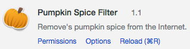
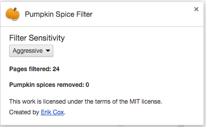

================================
The Pumpkin Spice Filter for Google Chrome that removes pumpkin spice from the Internet.

Overview
--------------------------
It's that time of year again. Want to remove all reference of pumpkin spice from the Internet? Install this extension.

Features
--------------------------

* Detects instances of pumpkin spice on web pages and removes them.
* Identifies sections of the page containing pumpkin spice and removes them from the page.
* Sensitivity settings to customize the aggressiveness of the filter - remove single references, chunks or the entire page.

Getting Started
--------------------------

Just install the extension from the [Chrome Web Store](https://chrome.google.com/webstore/detail/pumpkin-spice-filter/dkbgebgdlnllkcbinlljageehpipdepi), then browse the Internet without having to worry about pumpkin spice.

Contributing
-------------------------
Want to contribute? Just submit a pull request.

1) Grab latest source
<pre>
git clone https://github.com/erikcox/PS-GO.git
</pre>

2) Enable Chrome Extension in your Chrome install
<pre>
Open Chrome.
Navigate to Settings... Tools... Extensions.
Click + on "Developer mode"
Click "Load unpacked extensions..."
Navigate to directory you installed PS-Go and click Open.
</pre>

Authors
-------------------------

* Created by [Erik Cox](http://ecox.rocks/about/)

License
-------------------------
This project is licensed under the terms of the MIT license.

Acknowledgments
-------------------------
* Forked from [Rob Spectre's Trump Filter](https://github.com/RobSpectre/Trump-Filter).

